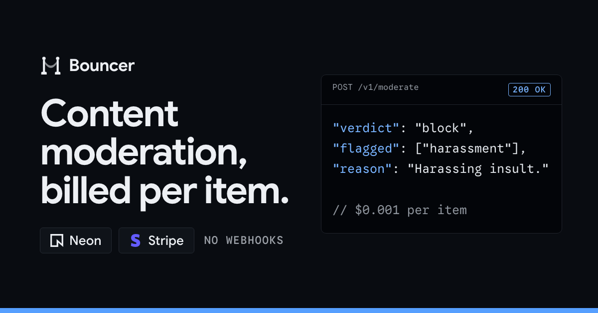

# Bouncer



A content moderation API, billed per item. Send text, get back allow, review or block with a
score per category. A reference app for **Stripe real-time sync to Postgres** on **Neon**, with
no Stripe webhooks anywhere.

```
 Customer ──Bearer bnc_…──▶ Neon Function `api` (POST /v1/moderate, custom domain)
                              │ 1 query: key → account → app.balances → price per item
                              │                     ▲ synced stripe.charges − usage ledger
                              ▼
                         Neon AI Gateway (fixed prompt, strict JSON) ──▶ validated verdicts
                                                     │
                                                     ▼ units → app.usage_events
                                                       (priced in SQL at write time)
 Dashboard ──Checkout (100% off)──▶ Stripe ══ real-time sync ══▶ stripe.checkout_sessions
 Neon Function `topups` (cron) ──$0 invoice──▶ Stripe ══▶ stripe.invoices
```

| Piece                                | Used for                                                                                                           |
| ------------------------------------ | ------------------------------------------------------------------------------------------------------------------ |
| Stripe Data Pipeline → Neon          | `stripe.*` tables: free orders (`checkout_sessions`), top-ups (`invoices`), paid orders (`charges`), prices, codes |
| Neon Functions + custom domain       | `api`: the public moderation endpoint, billed per item; `topups`: auto top-ups                                     |
| Neon schedule trigger                | runs `topups` every 5 minutes, even while Postgres is scaled to zero                                               |
| Neon AI Gateway                      | scores the items with `gpt-oss-20b` behind a fixed prompt; callers never pick a model or see a token               |
| Neon Auth (Managed Better Auth)      | dashboard sign-up/in; users live in `neon_auth.*`                                                                  |
| Next.js 16 on Vercel `cle1`          | dashboard and API routes, next to the Neon project in `aws-us-east-2`                                              |
| `@neondatabase/serverless` + Drizzle | every query, in the app and in the functions; schema/migrations on `DATABASE_URL_UNPOOLED`                         |
| Neon UI (ui.neon.com) + Hallmark     | components (metric cards, API key list, logs viewer, …) re-themed to the Cobalt system in `design.md`              |

## What is sold

A service, not model access. There is no chat endpoint, no `/v1/models`, no free-form prompt and
no per-token price:

- **Fixed task.** The `api` function owns the instructions. Callers send only the texts, which go
  to the model as JSON string values and are treated as data, never as instructions.
- **Checked output.** The model must answer in a strict JSON schema, and the function validates
  every score (0 to 1, one per category, one result per item). Output that fails is not charged.
- **Verdicts from fixed rules.** `allow`, `review` or `block` comes from the highest score against
  `MODERATION_THRESHOLDS` (0.4 and 0.8 in `src/shared/pricing.ts`), not from the model.
- **Priced per item.** One unit is one item of up to 2,000 characters (longer items count once
  per started 2,000). The price is in `app.service_prices`: $1 per 1,000 items at launch.

## How it works

- **The balance is derived, not stored.** `app.balances` = succeeded, undisputed Stripe charges
  (pro-rated for refunds) − the usage ledger. A refund in the Stripe Dashboard lowers the balance
  seconds later; nothing is ever incremented, so nothing can be double-credited.
- **One query per request to authorize.** The `api` function hashes the bearer key and, in one
  round trip, finds the account, reads its balance (pushed down to that one account) and the price
  per item. The charge is known before any work: units × unit price. Not enough balance →
  `402 insufficient_quota`, before anything runs.
- **Every request is a ledger row.** After the items are scored, the function writes the units
  sold and the tokens used: `price_micros` is `app.price_micros(service, units)` and `cost_micros`
  is `app.cost_micros(model, tokens…)` at AI Gateway list price, both in SQL. Past requests keep
  what they were charged, and the margin of every request is in the ledger. A request whose output
  failed validation is recorded with 0 units (its cost is ours).
- **Every purchase is free (for the demo).** `AUTO_PROMOTION_CODE = 'BOUNCER100'` (100% off,
  created by `npm run seed`) is applied to every Checkout Session and every top-up. A $0 order has
  no charge, so `app.balances` also counts completed $0 Checkout Sessions and paid $0 invoices at
  the pack's face value (`metadata.credits_cents`). Set the code to `null` to charge for real:
  Checkout then saves the card and top-ups charge it off-session.
- **Auto top-ups without webhooks.** Every 5 minutes `topups` finds accounts under their
  threshold and creates a Stripe invoice for the top-up with the promotion code (finalizing a $0
  invoice marks it paid; idempotency keys per 15-minute window). The invoice syncs back and the
  balance view counts it. A failure switches auto top-up off, with the reason in the dashboard.
- **Or top up now.** The dashboard's "Top up now" button runs the same code (`src/shared/topups.ts`,
  shared with the function) for your account, without waiting for the schedule: same threshold,
  same amount, same invoice. It skips the switch and the cooldown, but waits while the last top-up
  is still syncing, so a double click can't add credits twice.
- **Simulated usage, to demo auto top-up for free.** The dashboard's auto top-up card has
  "Use $1", "Use $5" and "Drop below threshold". They insert rows into `app.simulated_spend` (no
  moderation behind them, no cost); `app.balances` subtracts them like real usage, so the `topups`
  function refills the balance on its next run (or "Top up now" does it right away). Simulated
  spend never counts toward the daily limit, never takes a balance below zero, and shows as its own
  series in the chart and ledger.
- **Two requests per account per day.** A demo guard against abuse (`DAILY_REQUEST_LIMIT`),
  checked in the same query as the key and balance. Once used up: `429` with `Retry-After`.

Money is integer micro-dollars (`*_micros`); one item at launch price is 1,000 micros.

## API

```bash
curl "$API_BASE_URL/v1/moderate" \
  -H "Authorization: Bearer $BOUNCER_API_KEY" \
  -H "Content-Type: application/json" \
  -d '{"input": ["Great write-up, thanks!", "You are an idiot."]}'
```

```json
{
  "id": "…",
  "object": "moderation",
  "results": [
    { "verdict": "allow", "flagged": [], "scores": { "harassment": 0, "hate": 0, "…": 0 }, "reason": "" },
    { "verdict": "block", "flagged": ["harassment"], "scores": { "harassment": 0.9, "…": 0 }, "reason": "Harassing insult." }
  ],
  "usage": { "items": 2, "units": 2, "charge_usd": 0.002 }
}
```

- `POST /v1/moderate` with `{ "input": string | string[] }`: up to 20 items, 8,000 characters each.
- Categories: `harassment`, `hate`, `sexual`, `violence`, `self_harm`, `illicit`, `spam`, each
  scored 0 to 1. `flagged` lists those at 0.4 or more; `verdict` is `block` at 0.8 or more,
  `review` at 0.4 or more, `allow` otherwise.
- Responses carry `x-bouncer-request-id`, `x-bouncer-units`, `x-bouncer-charge-usd`,
  `x-bouncer-balance-usd`.
- Errors: `400` (bad input), `401` (key), `402` (balance below the quoted charge), `429` (daily
  limit, with `Retry-After`), `502` (scoring failed or AI Gateway unavailable; never charged).
- 2 requests per account per rolling 24 hours.

Dashboard routes (Next.js, session cookie):

| Route                         | Method      | What it does                                                                                     |
| ----------------------------- | ----------- | ------------------------------------------------------------------------------------------------ |
| `/api/checkout`               | POST        | `{ pack }` → Stripe Checkout URL (saves the card)                                                |
| `/api/account`                | GET         | balance, card on file, purchases, keys, usage (one round trip)                                   |
| `/api/account/auto-topup`     | PUT         | `{ enabled, thresholdCents, amountCents }`                                                       |
| `/api/account/auto-topup/run` | POST        | top up now (same rules as the `topups` function), skipping the wait for the next scheduled run   |
| `/api/usage/simulate`         | POST        | `{ kind: 'amount', cents }` or `{ kind: 'below-threshold' }`: simulated usage, no moderation run |
| `/api/keys`, `/api/keys/[id]` | POST/DELETE | create (plaintext returned once, SHA-256 stored) / revoke                                        |

## Setup

You need Node 24+, a paid Neon plan (Functions, AI Gateway) and Stripe real-time sync preview
access.

```bash
npm install
```

1. **Neon project:** `old-leaf-44412943` in `aws-us-east-2`, linked in `.neon`.
2. **Your secrets** in `.env` (see `.env.example`): `NEON_AUTH_COOKIE_SECRET`,
   `STRIPE_SECRET_KEY` (test mode) and `DEMO_PASSWORD`.
3. **Provision everything in `neon.ts`** (Auth, AI Gateway, both functions, the trigger):

   ```bash
   npm run neon:plan
   npx neon deploy            # later deploys to the protected main: --allow-protected
   ```

   Optional: set `API_CUSTOM_DOMAIN=api.yourdomain.com` before deploying to serve the API on
   your own domain, then set `API_BASE_URL=https://api.yourdomain.com` for the dashboard.

4. **Stripe pipeline:** Stripe Dashboard → Data management → Pipelines → **Neon**, pick this
   project, keep schema `stripe`, enable at least `customers`, `charges`, `payment_intents`,
   `checkout_sessions`, `invoices`, `prices` and `promotion_codes`.
5. **Migrate and seed.** The wallet view needs the `stripe` tables, so the migration checks for them first; the seed creates the Stripe prices and the promotion code:

   ```bash
   npm run db:migrate
   npm run seed
   ```

   Keep the `--> statement-breakpoint` markers between statements in `drizzle/*.sql`: the
   migrator splits on them, and the HTTP driver runs one statement per query.

6. **Run it:** `npm run dev`, click **Try the demo account** (`Phoenix`), buy credits (free:
   the code applies itself), create a key and moderate some text in the playground.

### Deploy to Vercel

`vercel.json` pins functions to `cle1`. Add the env vars from `.env`; `APP_URL` falls back to the
Vercel URLs.

## Security

- **SQL injection:** every query is Drizzle's builder or a tagged template (`sql`…``), both of
  which bind values as parameters. Ids from requests are validated as uuids first.
- **API keys:** 32 random bytes, shown once; only the SHA-256 is stored and compared.
- **HTTPS (production only):** when `NODE_ENV=production`, env validation requires `https://`
  for Neon Auth, the AI Gateway, the API base URL and `APP_URL` (plain `http://` only for
  localhost), and responses send HSTS, `nosniff`, `X-Frame-Options: DENY` and a small CSP.
  `npm run dev` skips both.

## Design

The look is a locked system in [`design.md`](design.md), produced with the
[Hallmark](https://www.usehallmark.com/) skill (`hallmark redesign`): modern-minimal, **Cobalt**
theme in its dark variant. Graphite paper, one electric-cobalt signal, Google Sans everywhere
(Google Sans Code for code), hairlines instead of shadows, code cards as proof, a working ⌘K
palette.

All values live in [`tokens.css`](tokens.css). The ui.neon.com components are used unmodified:
`tokens.css` maps their variables (`--background`, `--primary`, `--border`, …) onto the Cobalt
tokens. Marketing is a **Split Studio** page (claim beside proof, one raised band); the
dashboard is a **Workbench** app shell (a Neon Console-style sidebar, one view at a time, `?view=…`) built from Neon UI: metric cards, consumption chart, activity
feed, API key list, logs viewer, upgrade dialog.
Responsive at phone, tablet and desktop widths.

### Social card

`src/app/opengraph-image.png` is pre-rendered by `npm run og` (headless Chrome) from
`tokens.css` and the site's own faces. Re-run it only after changing the name, the copy or the
mark.
